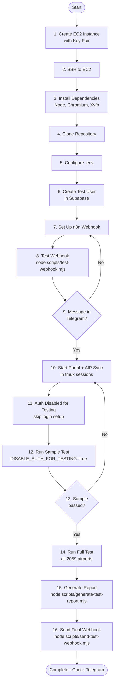

# Complete E2E Portal Testing Tutorial

This is a step-by-step guide covering **everything** from creating an EC2 instance to running the full E2E test suite and receiving results in Telegram.

## Table of Contents

1. [Prerequisites](#1-prerequisites)
2. [AWS Setup: IAM Role and Policy](#2-aws-setup-iam-role-and-policy)
3. [Launch EC2 Instance with Key Pair](#3-launch-ec2-instance-with-key-pair)
4. [Connect to EC2 and Install Dependencies](#4-connect-to-ec2-and-install-dependencies)
5. [Clone Repository and Install Project Dependencies](#5-clone-repository-and-install-project-dependencies)
6. [Configure Environment Variables](#6-configure-environment-variables)
7. [Create Test Account in Supabase](#7-create-test-account-in-supabase)
8. [Set Up n8n Webhook](#8-set-up-n8n-webhook)
9. [Test Webhook Integration](#9-test-webhook-integration)
10. [Start Portal and Sync Services](#10-start-portal-and-sync-services)
11. [Run Authentication Setup](#11-run-authentication-setup)
12. [Run Sample E2E Test](#12-run-sample-e2e-test)
13. [Run Full E2E Test](#13-run-full-e2e-test)
14. [Generate Report and Send to Telegram](#14-generate-report-and-send-to-telegram)
15. [Troubleshooting](#15-troubleshooting)

---

## 1) Prerequisites

Before starting, gather these credentials:

- **AWS Account** with permissions to create EC2, IAM roles, and S3 buckets
- **Supabase Project** (already set up for your portal)
  - `NEXT_PUBLIC_SUPABASE_URL`
  - `NEXT_PUBLIC_SUPABASE_ANON_KEY`
- **EAD Credentials** (for AIP sync)
  - `EAD_USER`
  - `EAD_PASSWORD_ENC` (generate with `node scripts/ead-encode-password.mjs "YourPassword"`)
- **Sync Secret** (same as your NOTAM sync secret)
  - `SYNC_SECRET` / `NOTAM_SYNC_SECRET`
- **n8n Webhook URL** (you'll set this up in step 8)
- **GitHub/Git Repository** access (to clone your clearway-2 repo)

---

## 2) AWS Setup: IAM Role and Policy

### 2a. Create S3 Policy for E2E Testing

1. Open **AWS Console** → **IAM** → **Policies** → **Create policy**
2. Click **JSON** tab
3. Paste this (replace `your-bucket-name` with your actual S3 bucket):

```json
{
  "Version": "2012-10-17",
  "Statement": [
    {
      "Effect": "Allow",
      "Action": [
        "s3:PutObject",
        "s3:GetObject",
        "s3:DeleteObject",
        "s3:ListBucket"
      ],
      "Resource": [
        "arn:aws:s3:::your-bucket-name/*",
        "arn:aws:s3:::your-bucket-name"
      ]
    }
  ]
}
```

1. Click **Next**
2. **Policy name:** `E2ETestingS3Access`
3. Click **Create policy**

### 2b. Create IAM Role for EC2

1. **IAM** → **Roles** → **Create role**
2. **Trusted entity type:** AWS service
3. **Use case:** EC2 → **Next**
4. **Permissions:** Search for `E2ETestingS3Access`, check the box → **Next**
5. **Role name:** `E2ETestingEC2Role`
6. Click **Create role**

---

## 3) Launch EC2 Instance with Key Pair

### Step-by-Step Instance Creation

1. **AWS Console** → **EC2** → **Instances** → **Launch instances**
2. **Name and tags:**
  - Name: `e2e-testing-portal`
3. **Application and OS Images (AMI):**
  - Click **Quick Start**
  - Select **Ubuntu**
  - Choose **Ubuntu Server 22.04 LTS (HVM), SSD Volume Type**
  - Architecture: **64-bit (x86)**
4. **Instance type:**
  - Select **t3.medium** (4 vCPU, 4 GB RAM)
  - This is recommended for running browser automation
5. **Key pair (login):**
  - **IMPORTANT:** Click **Create new key pair**
  - Key pair name: `e2e-testing-key`
  - Key pair type: **RSA**
  - Private key file format: **.pem**
  - Click **Create key pair**
  - **Your browser will download `e2e-testing-key.pem`** - save it securely!
6. **Network settings:**
  - Click **Edit**
  - **Auto-assign public IP:** Enable
  - **Firewall (security groups):** Create security group
  - Security group name: `e2e-testing-sg`
  - Description: `E2E testing security group`
  - **Inbound security groups rules:**
    - Rule 1: SSH, TCP 22, Source type: My IP (or your IP)
    - Click **Add security group rule**
    - Rule 2: Custom TCP, Port 3000, Source type: My IP (for portal access)
    - Click **Add security group rule**
    - Rule 3: Custom TCP, Port 3002, Source type: My IP (for AIP sync server)
7. **Configure storage:**
  - Size: **30 GiB**
  - Volume type: **gp3**
8. **Advanced details:**
  - Scroll down to **IAM instance profile**
  - Select **E2ETestingEC2Role** (from step 2b)
  - **User data:** Paste this to auto-install dependencies on first boot:

```bash
#!/bin/bash
set -e
export DEBIAN_FRONTEND=noninteractive

# Update system
apt-get update

# Install essential tools
apt-get install -y xvfb unzip curl git tmux

# Install Node.js 20
curl -fsSL https://deb.nodesource.com/setup_20.x | bash -
apt-get install -y nodejs

# Install Chromium
apt-get install -y chromium-browser || apt-get install -y chromium

# Update npm
npm install -g npm@latest

echo "EC2 user data script completed" > /var/log/user-data-complete.log
```

1. **Summary:**
  - Review all settings
  - Click **Launch instance**
2. **Wait for instance to be running:**
  - Go to **Instances** in EC2 console
    - Wait until **Instance state** shows **Running**
    - Wait until **Status checks** shows **2/2 checks passed** (takes 2-3 minutes)
    - Note the **Public IPv4 address** (e.g., `3.123.45.67`)

---

## 4) Connect to EC2 and Install Dependencies

### 4a. Set Key Permissions

On your local machine, find where `e2e-testing-key.pem` was downloaded (usually `~/Downloads/`):

```bash
# Move to a secure location
mkdir -p ~/.ssh/aws-keys
mv ~/Downloads/e2e-testing-key.pem ~/.ssh/aws-keys/

# Set correct permissions (required by SSH)
chmod 400 ~/.ssh/aws-keys/e2e-testing-key.pem
```

### 4b. Connect via SSH

Replace `3.123.45.67` with your EC2's public IP:

```bash
ssh -i ~/.ssh/aws-keys/e2e-testing-key.pem ubuntu@3.123.45.67
```

If prompted "Are you sure you want to continue connecting?", type `yes` and press Enter.

You should now see the Ubuntu welcome message and a prompt like `ubuntu@ip-172-31-x-x:~$`.

### 4c. Verify User Data Installation

Check if the user data script completed:

```bash
cat /var/log/user-data-complete.log
```

If you see "EC2 user data script completed", dependencies are installed. Verify:

```bash
node -v    # Should show v20.x.x
npm -v     # Should show 10.x.x
which chromium-browser || which chromium
xvfb-run --help
```

If any command fails, the user data didn't complete. Run this manually:

```bash
sudo bash << 'EOF'
export DEBIAN_FRONTEND=noninteractive
apt-get update
apt-get install -y xvfb unzip curl git tmux
curl -fsSL https://deb.nodesource.com/setup_20.x | bash -
apt-get install -y nodejs
apt-get install -y chromium-browser 2>/dev/null || apt-get install -y chromium
npm install -g npm@latest
EOF
```

---

## 5) Clone Repository and Install Project Dependencies

### 5a. Clone the Repository

```bash
cd ~
git clone https://github.com/YOUR-USERNAME/clearway-2.git
cd clearway-2
```

Replace `YOUR-USERNAME` with your GitHub username/org.

If your repo is private, you may need to:

- Use SSH: `git clone git@github.com:YOUR-USERNAME/clearway-2.git` (requires SSH key)
- Or use a personal access token: `git clone https://YOUR-TOKEN@github.com/YOUR-USERNAME/clearway-2.git`

### 5b. Install Node Dependencies

```bash
npm install
```

This installs all packages from `package.json`, including Playwright.

### 5c. Install Playwright Browsers

```bash
npx playwright install chromium
npx playwright install-deps chromium
```

This downloads Chromium and its system dependencies for Playwright.

### 5d. Clean Start (Reset Server State)

If you want to restart from scratch, use one of these options.

**Option A - Light clean (keep repo and env):**

```bash
tmux kill-session -t portal 2>/dev/null || true
tmux kill-session -t aip-sync 2>/dev/null || true
tmux kill-session -t e2e-test 2>/dev/null || true
pkill -f "next dev" 2>/dev/null || true
pkill -f "aip-sync-server" 2>/dev/null || true
cd ~/clearway-2
rm -rf test-results/*
mkdir -p test-results/raw test-results/screenshots
```

**Option B - Full clean (like a new instance):**

```bash
# Optional backup of .env
# scp -i key.pem ubuntu@EC2_IP:~/clearway-2/.env ./env-backup.txt

tmux kill-server 2>/dev/null || true
pkill -f "node" 2>/dev/null || true

cd ~
rm -rf clearway-2
git clone https://github.com/YOUR-USERNAME/clearway-2.git
cd clearway-2
npm install
npx playwright install --with-deps chromium

# Recreate env from section 6
nano .env
set -a && source .env && set +a
```

---

## 6) Configure Environment Variables

### 6a. Create Environment File

Create a `.env` file in the project root:

```bash
cd ~/clearway-2
nano .env
```

### 6b. Add All Required Variables

Paste this template and replace all values with your actual credentials:

```bash
# Portal URL (local on EC2)
export PORTAL_URL=http://localhost:3000

# Disable AI to save tokens during testing
export DISABLE_AI_FOR_TESTING=true

# Disable portal auth on isolated test instance
export DISABLE_AUTH_FOR_TESTING=true

# Supabase (copy from your Vercel env or Supabase dashboard)
export NEXT_PUBLIC_SUPABASE_URL=https://xxxxx.supabase.co
export NEXT_PUBLIC_SUPABASE_ANON_KEY=eyJhbGciOiJIUzI1NiIsInR5cCI6IkpXVCJ9...

# Sync server configuration
export AIP_SYNC_URL=http://localhost:3002
export NOTAM_SYNC_URL=http://localhost:3001
export NOTAM_SYNC_SECRET=your-sync-secret-here
export SYNC_SECRET=your-sync-secret-here

# EAD credentials for AIP sync
export EAD_USER=your-ead-username
export EAD_PASSWORD_ENC=your-base64-encoded-password

# CrewBriefing credentials for NOTAM sync scraper
export CREWBRIEFING_USER=your-crewbriefing-username
export CREWBRIEFING_PASSWORD=your-crewbriefing-password

# OpenAI (NOT NEEDED when DISABLE_AI_FOR_TESTING=true - skip these)
# export OPENAI_API_KEY=sk-...
# export OPENAI_MODEL=gpt-4o-mini

# OpenRouter (NOT NEEDED when DISABLE_AI_FOR_TESTING=true - skip these)
# export OPENROUTER_API_KEY=sk-or-v1-...

# AWS S3 (for caching, report uploads, and screenshot links in report)
export AWS_S3_BUCKET=myapp-notams-prod
export AWS_REGION=us-east-1

# n8n Webhook (you'll get this in step 8)
export N8N_WEBHOOK_URL=https://your-n8n-instance.com/webhook/xxxxx

# Optional: S3 report key prefix and URL expiry (seconds)
export E2E_REPORTS_S3_PREFIX=e2e-reports
export E2E_REPORT_URL_EXPIRES_IN=259200

# Test results directory
export TEST_RESULTS_DIR=/home/ubuntu/clearway-2/test-results
```

### 6c. Save and Load Environment

Save the file:

- Press `Ctrl+O` (WriteOut)
- Press `Enter` (confirm filename)
- Press `Ctrl+X` (exit nano)

Load the environment variables:

```bash
set -a && source .env && set +a
```

Verify they're loaded:

```bash
echo $PORTAL_URL
echo $DISABLE_AI_FOR_TESTING
echo $DISABLE_AUTH_FOR_TESTING
```

---

## 7) Create Test Account in Supabase

### Option A: Via Supabase Dashboard (Recommended)

1. Open **Supabase Dashboard** → Your project
2. Go to **Authentication** → **Users**
3. Click **Add user** → **Create new user**
4. Email: `test@clearway.com` (or the email you set in `.env`)
5. Password: Create a strong password (you won't need it for E2E - we'll use magic link)
6. Click **Create user**
7. The user is created instantly (no email verification needed for manual creation)

### Option B: Via Portal (After Portal is Running)

Skip this for now - we'll use Option A. You can create via portal later if needed.

### 7b. Set User Preferences (AI Models)

Since `DISABLE_AI_FOR_TESTING=true`, the portal won't require model selection. But to avoid the first-login picker:

1. In Supabase Dashboard → **SQL Editor**
2. Run this query (replace `test@clearway.com` with your test email):

```sql
-- Get user ID
SELECT id FROM auth.users WHERE email = 'test@clearway.com';

-- Insert preferences (replace USER_ID with the ID from above)
INSERT INTO user_preferences (user_id, aip_model, gen_model)
VALUES ('USER_ID_HERE', 'gpt-4o-mini', 'gpt-4o-mini')
ON CONFLICT (user_id) 
DO UPDATE SET aip_model = 'gpt-4o-mini', gen_model = 'gpt-4o-mini';
```

Or do it in one query:

```sql
INSERT INTO user_preferences (user_id, aip_model, gen_model)
SELECT id, 'gpt-4o-mini', 'gpt-4o-mini'
FROM auth.users 
WHERE email = 'test@clearway.com'
ON CONFLICT (user_id) 
DO UPDATE SET aip_model = 'gpt-4o-mini', gen_model = 'gpt-4o-mini';
```

---

## 8) Set Up n8n Webhook

### 8a. Create Webhook in n8n

1. Open your **n8n instance** (self-hosted or cloud)
2. Create a **New Workflow**
3. Add a **Webhook** node:
  - Click **+** → Search "Webhook" → Select **Webhook**
  - **HTTP Method:** POST
  - **Path:** Choose a path like `e2e-portal-test`
  - **Authentication:** None (or Basic if you prefer)
  - Click **Execute Node** to get the webhook URL
  - Copy the **Test URL** (e.g., `https://your-n8n.com/webhook-test/e2e-portal-test`)
4. Add a **Telegram** node:
  - Click **+** after Webhook → Search "Telegram" → Select **Telegram**
  - **Credential:** Add your Telegram Bot credentials
  - **Chat ID:** Your Telegram chat/channel ID
  - **Message Type:** Text
  - **Text:** Use expressions to format the webhook data:

```
🧪 E2E Test Notification

Event: {{ $json.event || "nil" }}
Timestamp: {{ $json.timestamp || "nil" }}
Message: {{ $json.message || "nil" }}

📊 Summary:
- Total: {{ $json.summary.total || "nil" }}
- Passed: {{ $json.summary.passed || "nil" }}
- Failed: {{ $json.summary.failed || "nil" }}

📄 Report: {{ $json.reportUrl || "nil" }}
```

1. **Connect** Webhook → Telegram nodes
2. **Save** the workflow
3. **Activate** the workflow (toggle in top-right)
4. Copy the **Production URL** (e.g., `https://your-n8n.com/webhook/e2e-portal-test`)

### 8b. Update EC2 Environment

Back on EC2, update the `.env` file:

```bash
nano ~/.clearway-2/.env
```

Find the line with `N8N_WEBHOOK_URL` and update it:

```bash
export N8N_WEBHOOK_URL=https://your-n8n.com/webhook/e2e-portal-test
```

Save and reload:

```bash
set -a && source ~/clearway-2/.env && set +a
```

---

## 9) Test Webhook Integration

**CRITICAL:** You MUST test the webhook before running the full E2E test.

### 9a. Run Webhook Test Script

```bash
cd ~/clearway-2
node scripts/test-webhook.mjs
```

Expected output:

```
Webhook test sent successfully.
URL: https://your-n8n.com/webhook/e2e-portal-test
Response: ok
```

### 9b. Verify in Telegram

Check your Telegram chat/channel. You should receive a message like:

```
🧪 E2E Test Notification

Event: webhook_test
Timestamp: 2026-03-05T12:34:56.789Z
Message: Testing n8n webhook for E2E portal testing
```

### 9c. Troubleshooting Webhook

If the webhook test fails:

**Error: "Missing webhook URL"**

- Check `.env` has `N8N_WEBHOOK_URL` set
- Reload env: `set -a && source ~/clearway-2/.env && set +a`

**Error: "Webhook test failed (404)"**

- Verify the webhook URL is correct
- Check n8n workflow is **activated** (toggle in top-right)
- Use the **Production URL**, not Test URL

**Error: "Webhook test failed (500)"**

- Check n8n workflow logs for errors
- Verify Telegram node is configured correctly
- Test the Telegram node independently in n8n

**No message in Telegram:**

- Verify Telegram bot token is correct
- Verify chat ID is correct
- Check n8n execution history for errors

**DO NOT PROCEED** until you see the test message in Telegram.

---

## 10) Start Portal and Sync Services

You need 4 terminal sessions running simultaneously. Use `tmux` to manage them.

### 10a. Terminal 1: Portal (Next.js)

```bash
# Start tmux session
tmux new -s portal

# Load environment
cd ~/clearway-2
set -a && source .env && set +a

# Start portal with AI + auth disabled for E2E testing
DISABLE_AI_FOR_TESTING=true DISABLE_AUTH_FOR_TESTING=true npm run dev
```

Wait until you see:

```
✓ Ready in Xms
○ Local:        http://localhost:3000
```

**Detach from tmux:** Press `Ctrl+B`, release, then press `D`

### 10b. Terminal 2: AIP Sync Server

```bash
# Create new tmux session
tmux new -s aip-sync

# Load environment
cd ~/clearway-2
set -a && source .env && set +a

# Start AIP sync server with AI disabled (auth flag kept consistent)
DISABLE_AI_FOR_TESTING=true DISABLE_AUTH_FOR_TESTING=true node scripts/aip-sync-server.mjs
```

Wait until you see:

```
AIP sync server listening on port 3002 | download: scripts/ead-download-aip-pdf.mjs | extract: REGEX (AI disabled for testing)
```

**Detach from tmux:** Press `Ctrl+B`, release, then press `D`

### 10c. Terminal 3: NOTAM Sync Server

```bash
# Create new tmux session
tmux new -s notam-sync

# Load environment
cd ~/clearway-2
set -a && source .env && set +a

# Start NOTAM sync server
DISABLE_AI_FOR_TESTING=true DISABLE_AUTH_FOR_TESTING=true node scripts/notam-sync-server.mjs
```

Wait until you see:

```
NOTAM sync server listening on port 3001 | scraper: scripts/crewbriefing-notams.mjs
```

**Detach from tmux:** Press `Ctrl+B`, release, then press `D`

### 10d. Terminal 4: Your Working Terminal

This is your main terminal where you'll run E2E commands. Keep this one active (don't detach).

### 10e. Verify Services Are Running

Check all services are up:

```bash
# Check portal
curl -s http://localhost:3000 | head -n 20

# Check AIP sync server
curl -s http://localhost:3002/

# Check NOTAM sync server
curl -s "http://localhost:3001/sync?icao=DFFD&secret=$SYNC_SECRET"

# List tmux sessions
tmux ls
```

You should see:

- Portal returns HTML
- AIP sync returns 404 (expected - needs `/sync` path)
- NOTAM sync returns JSON (or sync error detail if credentials are wrong)
- Three tmux sessions: `portal`, `aip-sync`, and `notam-sync`

### 10f. Reattach to tmux Sessions (if needed)

To view logs or restart services:

```bash
# View portal logs
tmux attach -t portal
# Ctrl+B then D to detach

# View AIP sync logs
tmux attach -t aip-sync
# Ctrl+B then D to detach

# View NOTAM sync logs
tmux attach -t notam-sync
# Ctrl+B then D to detach
```

---

## 11) Run Authentication Setup

Authentication is disabled for E2E runs via:

```bash
export DISABLE_AUTH_FOR_TESTING=true
```

No magic links, login browser flows, or Playwright auth-state setup are required.
Skip directly to Section 12.

---

## 12) Run Sample E2E Test

Before running the full test (2,000+ airports, 4-6 hours), run a small sample to verify everything works.

### 12a. Test 5 Airports

```bash
cd ~/clearway-2
set -a && source .env && set +a

DISABLE_AUTH_FOR_TESTING=true MAX_AIRPORTS=5 node scripts/e2e-portal-test.mjs
```

### 12b. Monitor Progress

You'll see output like:

```
[1] Testing Albania (LA) :: LAKU
[2] Testing Albania (LA) :: LATI
[3] Testing Armenia (UD) :: UDSG
[4] Testing Armenia (UD) :: UDYZ
[5] Testing Austria (LO) :: LOAV
E2E run complete. Raw results: test-results/raw/e2e-results-2026-03-05T12-34-56-789Z.json
```

### 12c. Check Results

```bash
# View raw JSON results
cat test-results/raw/e2e-results-*.json | jq '.summary'

# Check screenshots were captured
ls -lh test-results/screenshots/
```

Expected output:

```json
{
  "totalCountries": 3,
  "totalAirports": 5,
  "passedAirports": 4,
  "failedAirports": 1
}
```

### 12d. Generate Sample Report

```bash
node scripts/generate-test-report.mjs
```

Output:

```
Report generated: test-results/report-2026-03-05T12-35-00-123Z.md
```

View the report:

```bash
cat test-results/report-*.md | head -n 50
```

### 12e. Send Sample Webhook

```bash
node scripts/send-test-webhook.mjs
```

Expected output:

```
Uploaded report to s3://myapp-notams-prod/e2e-reports/report-2026-03-05T12-35-00-123Z.md
Webhook sent successfully.
Report file: test-results/report-2026-03-05T12-35-00-123Z.md
Report URL: https://myapp-notams-prod.s3.... (presigned download link)
Response: ok
```

### 12f. Check Telegram

You should receive a message in Telegram with:

- Event: `e2e_test_complete`
- Summary stats (5 total, 4 passed, 1 failed)
- Report URL (presigned S3 download link)

**If webhook fails here:**

- Check `N8N_WEBHOOK_URL` in `.env`
- Verify n8n workflow is still activated
- Run `node scripts/test-webhook.mjs` again

---

## 13) Run Full E2E Test

Once the sample test succeeds and webhook works, run the full test.

### 13a. Prepare for Long Run

The full test takes 4-6 hours. Recommendations:

1. **Use tmux** so it continues if SSH disconnects:

```bash
tmux new -s e2e-test
```

1. **Load environment:**

```bash
cd ~/clearway-2
set -a && source .env && set +a
```

1. **Optional: Test specific country first:**

```bash
COUNTRY_FILTER=albania node scripts/e2e-portal-test.mjs
```

### 13b. Start Full Test

```bash
node scripts/e2e-portal-test.mjs
```

### 13c. Monitor Progress

The script logs each airport as it tests:

```
[1] Testing Albania (LA) :: LAKU
[2] Testing Albania (LA) :: LATI
[3] Testing Armenia (UD) :: UDSG
...
[2059] Testing United Kingdom (EG) :: EGZZ
E2E run complete. Raw results: test-results/raw/e2e-results-2026-03-05T18-45-00-000Z.json
```

You can detach from tmux and check back later:

- **Detach:** `Ctrl+B` then `D`
- **Reattach:** `tmux attach -t e2e-test`

### 13d. Monitor from Another Terminal

While the test runs, you can SSH in another terminal and check:

```bash
# Check latest results
tail -f ~/clearway-2/test-results/raw/e2e-results-*.json

# Count screenshots
find ~/clearway-2/test-results/screenshots -name "*.png" | wc -l

# Check disk space
df -h
```

### 13e. Estimated Duration

- **All 2,059 airports:** 4-6 hours
- **Per airport average:** 8-15 seconds
  - Page load: 1-2s
  - Map: 2-3s
  - NOTAMs: 2-5s
  - AIP: 0-3s (hardcoded) or 5-10s (EAD sync)
  - GEN: 0s (hardcoded) or 5-10s (EAD sync)
  - Screenshot: 1-2s

---

## 14) Generate Report and Send to Telegram

After the E2E test completes:

### 14a. Generate Markdown Report

```bash
cd ~/clearway-2
node scripts/generate-test-report.mjs
```

Output:

```
Report generated: test-results/report-2026-03-05T18-45-30-000Z.md
```

### 14b. Review Report Locally

```bash
# View summary
head -n 50 test-results/report-*.md

# Count total lines
wc -l test-results/report-*.md

# Search for failures
grep -n "❌" test-results/report-*.md | head -n 20
```

### 14c. Optional: Upload Report to S3

`send-test-webhook.mjs` now uploads the report to S3 and generates a presigned download URL automatically.
Manual `aws s3 cp` and `aws s3 presign` are no longer required for the normal flow.

### 14d. Send Final Webhook to Telegram

```bash
node scripts/send-test-webhook.mjs
```

Or with explicit report URL:

```bash
REPORT_URL="https://your-domain.com/reports/report-2026-03-05.md" \
node scripts/send-test-webhook.mjs
```

### 14e. Check Telegram

You should receive a message with:

```
🧪 E2E Test Notification

Event: e2e_test_complete
Timestamp: 2026-03-05T18:45:45.000Z

📊 Summary:
- Total: 2059
- Passed: 1950
- Failed: 109

📄 Report: https://your-domain.com/reports/report-2026-03-05.md
```

### 14f. Download Results to Local Machine

To analyze results locally:

```bash
# From your local machine
scp -i ~/.ssh/aws-keys/e2e-testing-key.pem \
  -r ubuntu@3.123.45.67:~/clearway-2/test-results/ \
  ./e2e-results-backup/
```

---

## 15) Troubleshooting

### Portal Won't Start

**Error: "Port 3000 already in use"**

```bash
# Find and kill process on port 3000
sudo lsof -ti:3000 | xargs sudo kill -9

# Or use a different port
PORT=3001 npm run dev
```

**Error: "Cannot find module"**

```bash
# Reinstall dependencies
cd ~/clearway-2
rm -rf node_modules package-lock.json
npm install
```

### AIP Sync Server Won't Start

**Error: "Port 3002 already in use"**

```bash
# Find and kill process
sudo lsof -ti:3002 | xargs sudo kill -9

# Or set different port
AIP_SYNC_PORT=3003 node scripts/aip-sync-server.mjs
```

### E2E Test Fails Immediately

**Error: "Not authenticated and running headless"**

- Auth state file is missing or invalid
- Regenerate: Follow step 11c to create `auth-state.json`

**Error: "Cannot reach portal"**

```bash
# Verify portal is running
curl http://localhost:3000

# Check tmux session
tmux attach -t portal
```

**Error: "fetch failed for [http://localhost:3000/api/regions](http://localhost:3000/api/regions)"**

- Portal isn't fully started yet
- Wait 30 seconds and try again
- Check portal logs: `tmux attach -t portal`

### Map Check Fails for All Airports

**Cause:** Missing coordinates in `data/airport-coords.json`

This is expected for some airports. The test marks it as failed but continues.

### NOTAM Check Fails

**Error: "NOTAMs unavailable"**

Possible causes:

- NOTAM sync server not running (should be, but E2E doesn't require it)
- ICAO not found in CrewBriefing/FAA
- Network timeout

This is expected for some airports. The test logs the error and continues.

### AIP/GEN Sync Fails

**Error: "No AI model selected"**

- `DISABLE_AI_FOR_TESTING` not set correctly
- Check `.env` has `export DISABLE_AI_FOR_TESTING=true`
- Reload env and restart services

**Error: "AIP sync request failed"**

- AIP sync server not running
- Check: `tmux attach -t aip-sync`
- Verify: `curl http://localhost:3002/sync?icao=EDDF`

### Screenshots Not Captured

**Error: "Screenshot failed: Protocol error"**

- Playwright timeout
- Page didn't load fully
- Increase timeout in script (not recommended - let it fail and continue)

**Error: "ENOSPC: no space left on device"**

```bash
# Check disk space
df -h

# Clean up old test results
rm -rf test-results/screenshots/*
rm -rf test-results/raw/*
```

### Webhook Send Fails

**Error: "Missing webhook URL"**

```bash
# Verify env
echo $N8N_WEBHOOK_URL

# If empty, reload
set -a && source ~/clearway-2/.env && set +a
```

**Error: "Webhook failed (404)"**

- n8n workflow deactivated
- Wrong webhook URL
- Run test webhook again: `node scripts/test-webhook.mjs`

### EC2 Instance Becomes Unresponsive

**Symptoms:**

- SSH hangs
- Can't connect
- Status checks fail

**Solution:**

1. **AWS Console** → **EC2** → Select instance
2. **Instance state** → **Reboot instance**
3. Wait 2-3 minutes
4. Note: Public IP may change if you don't have Elastic IP
5. SSH with new IP
6. Restart services (follow step 10)

**Prevention:**

- Use at least t3.medium (4 GB RAM)
- Monitor memory: `free -h`
- Monitor disk: `df -h`

---

## Quick Reference: All Commands in Order

### Initial Setup (once)

```bash
# 1. SSH to EC2
ssh -i ~/.ssh/aws-keys/e2e-testing-key.pem ubuntu@YOUR-EC2-IP

# 2. Clone repo
cd ~
git clone https://github.com/YOUR-USERNAME/clearway-2.git
cd clearway-2

# 3. Install dependencies
npm install
npx playwright install chromium
npx playwright install-deps chromium

# 4. Create and configure .env
nano .env
# (paste all env vars from step 6b)

# 5. Load environment
set -a && source .env && set +a

# 6. Test webhook
node scripts/test-webhook.mjs
# (verify message in Telegram)
```

### Start Services (each time)

```bash
# Terminal 1: Portal
tmux new -s portal
cd ~/clearway-2 && set -a && source .env && set +a
DISABLE_AI_FOR_TESTING=true npm run dev
# Ctrl+B then D to detach

# Terminal 2: AIP Sync
tmux new -s aip-sync
cd ~/clearway-2 && set -a && source .env && set +a
DISABLE_AI_FOR_TESTING=true node scripts/aip-sync-server.mjs
# Ctrl+B then D to detach
```

### Run Tests

```bash
# Terminal 3: E2E Testing
cd ~/clearway-2
set -a && source .env && set +a

# Sample test (5 airports)
DISABLE_AUTH_FOR_TESTING=true MAX_AIRPORTS=5 node scripts/e2e-portal-test.mjs

# Generate report
node scripts/generate-test-report.mjs

# Send webhook
node scripts/send-test-webhook.mjs

# Full test (all airports, 4-6 hours)
tmux new -s e2e-test
DISABLE_AUTH_FOR_TESTING=true node scripts/e2e-portal-test.mjs
# Ctrl+B then D to detach

# After full test completes
node scripts/generate-test-report.mjs
node scripts/send-test-webhook.mjs
```

### Using npm Scripts

```bash
# Test webhook
npm run test:e2e:webhook:test

# Run E2E test
npm run test:e2e

# Generate report
npm run test:e2e:report

# Send webhook
npm run test:e2e:webhook:send
```

---

## Environment Variables Reference

### Required for E2E Testing


| Variable                        | Example                       | Purpose                      |
| ------------------------------- | ----------------------------- | ---------------------------- |
| `PORTAL_URL`                    | `http://localhost:3000`       | Portal URL to test           |
| `DISABLE_AI_FOR_TESTING`        | `true`                        | Skip AI calls to save tokens |
| `DISABLE_AUTH_FOR_TESTING`      | `true`                        | Bypass portal login for E2E  |
| `NEXT_PUBLIC_SUPABASE_URL`      | `https://xxx.supabase.co`     | Supabase project URL         |
| `NEXT_PUBLIC_SUPABASE_ANON_KEY` | `eyJ...`                      | Supabase anon key            |
| `AIP_SYNC_URL`                  | `http://localhost:3002`       | AIP sync server URL          |
| `NOTAM_SYNC_URL`                | `http://localhost:3001`       | NOTAM sync server URL        |
| `NOTAM_SYNC_SECRET`             | `your-secret`                 | Sync authentication          |
| `SYNC_SECRET`                   | `your-secret`                 | Same as NOTAM_SYNC_SECRET    |
| `EAD_USER`                      | `username`                    | EAD login username           |
| `EAD_PASSWORD_ENC`              | `base64...`                   | Base64 encoded password      |
| `CREWBRIEFING_USER`             | `username`                    | CrewBriefing login username (NOTAM scraper) |
| `CREWBRIEFING_PASSWORD`         | `password`                    | CrewBriefing login password (NOTAM scraper) |
| `N8N_WEBHOOK_URL`               | `https://n8n.com/webhook/...` | Webhook endpoint             |


### Optional


| Variable                    | Default             | Purpose                                        |
| --------------------------- | ------------------- | ---------------------------------------------- |
| `HEADLESS`                  | `true`              | Set to `false` for visible browser             |
| `MAX_AIRPORTS`              | `0` (all)           | Limit number of airports to test               |
| `COUNTRY_FILTER`            | `""`                | Filter countries by name                       |
| `TEST_RESULTS_DIR`          | `test-results`      | Output directory                               |
| `AWS_S3_BUCKET`             | `myapp-notams-prod` | S3 bucket for report + screenshot uploads      |
| `AWS_REGION`                | `us-east-1`         | AWS region                                     |
| `E2E_REPORTS_S3_PREFIX`     | `e2e-reports`       | S3 key prefix for report files and screenshots |
| `E2E_REPORT_URL_EXPIRES_IN` | `259200`            | Presigned URL expiration (seconds)             |


---

## Test Results Structure

### Directory Layout

```
test-results/
├── auth-state.json                          # Playwright auth state
├── raw/
│   └── e2e-results-2026-03-05T12-34-56.json # Raw test data
├── screenshots/
│   ├── Albania_LA/
│   │   ├── LAKU.png
│   │   └── LATI.png
│   ├── Austria_LO/
│   │   ├── LOAV.png
│   │   └── LOWG.png
│   └── ...
└── report-2026-03-05T12-35-00.md            # Markdown report
```

### Raw Results JSON Structure

```json
{
  "startedAt": "2026-03-05T12:34:56.789Z",
  "finishedAt": "2026-03-05T18:45:00.000Z",
  "portalUrl": "http://localhost:3000",
  "disableAiForTesting": true,
  "countries": [
    {
      "country": "Albania (LA)",
      "airports": [
        {
          "icao": "LAKU",
          "name": "Kukës International Airport",
          "country": "Albania (LA)",
          "isEad": true,
          "startedAt": "2026-03-05T12:34:56.789Z",
          "finishedAt": "2026-03-05T12:35:10.123Z",
          "checks": {
            "pageLoad": { "pass": true },
            "map": { "pass": true, "hasCoords": true },
            "notams": { "pass": true, "skipped": false },
            "aip": { "pass": true, "skippedAi": true },
            "gen": { "pass": true, "skipped": false, "skippedAi": true },
            "screenshot": { "pass": true, "path": "test-results/screenshots/Albania_LA/LAKU.png" }
          },
          "errors": []
        }
      ]
    }
  ],
  "summary": {
    "totalCountries": 47,
    "totalAirports": 2059,
    "passedAirports": 1950,
    "failedAirports": 109
  }
}
```

---

## What Each Script Does

### `scripts/test-webhook.mjs`

**Purpose:** Test n8n webhook before running E2E

**Usage:**

```bash
node scripts/test-webhook.mjs
```

**What it does:**

1. Reads `N8N_WEBHOOK_URL` from env
2. Sends test payload with `event: "webhook_test"`
3. Logs success/failure
4. You verify message appears in Telegram

**When to run:** BEFORE any E2E test run

---

### `scripts/e2e-portal-test.mjs`

**Purpose:** Main E2E test automation

**Usage:**

```bash
# Full test
node scripts/e2e-portal-test.mjs

# With options
MAX_AIRPORTS=10 COUNTRY_FILTER=albania node scripts/e2e-portal-test.mjs
```

**What it does:**

1. Launches Playwright browser (headless by default)
2. Loads auth state from `test-results/auth-state.json`
3. Fetches all countries from `/api/regions`
4. For each country, fetches airports from `/api/airports`
5. For each airport:
  - Navigates to portal with ICAO
  - Checks page loads
  - Checks map loads
  - Clicks NOTAM sync and waits
  - Clicks AIP sync (EAD only) and waits
  - Clicks GEN sync (EAD only) and waits
  - Takes full-page screenshot
  - Saves results incrementally to JSON
6. Outputs final summary

**Output:** `test-results/raw/e2e-results-{timestamp}.json`

---

### `scripts/generate-test-report.mjs`

**Purpose:** Convert raw JSON to readable markdown

**Usage:**

```bash
# Auto-picks latest results
node scripts/generate-test-report.mjs

# Or specify input
node scripts/generate-test-report.mjs --input=test-results/raw/e2e-results-xxx.json
```

**What it does:**

1. Reads raw JSON results
2. Generates markdown with:
  - Summary stats
  - Per-country sections
  - Per-airport checklist with pass/fail
  - Screenshot links
  - Error details
3. Saves to `test-results/report-{timestamp}.md`

**Output:** `test-results/report-{timestamp}.md`

---

### `scripts/send-test-webhook.mjs`

**Purpose:** Send final report notification to Telegram via n8n

**Usage:**

```bash
# Auto-picks latest report
node scripts/send-test-webhook.mjs

# Or specify files
node scripts/send-test-webhook.mjs \
  --report-path=test-results/report-xxx.md \
  --raw-json-path=test-results/raw/e2e-results-xxx.json \
  --report-url=https://your-domain.com/report.md
```

**What it does:**

1. Finds latest report markdown
2. Finds latest raw JSON for summary stats
3. Constructs webhook payload with:
  - Event: `e2e_test_complete`
  - Summary (total/passed/failed)
  - Report URL (if provided)
4. POSTs to `N8N_WEBHOOK_URL`
5. Logs success/failure

**Output:** Telegram notification via n8n

---

## Complete Workflow Diagram




---

## Expected Test Results

### Success Rates (Approximate)

Based on the portal's current state:


| Check           | Expected Pass Rate | Common Failures              |
| --------------- | ------------------ | ---------------------------- |
| Page Load       | 99%+               | Network errors only          |
| Map             | 95%+               | Missing coordinates in data  |
| NOTAMs          | 90%+               | ICAO not in CrewBriefing/FAA |
| AIP (Hardcoded) | 100%               | Static data always available |
| AIP (EAD)       | 85%+               | Sync timeout, EAD blocks IP  |
| GEN             | 80%+               | Depends on AIP success       |
| Screenshot      | 99%+               | Disk full, permission errors |


### Sample Report Output

```markdown
# Portal E2E Test Report

Generated: 2026-03-05T18:45:30.000Z
Source run started: 2026-03-05T12:34:56.789Z
Portal URL: http://localhost:3000
AI disabled for testing: true

## Summary

- Total Countries: 47
- Total Airports: 2,059
- Passed Airports: 1,950 (94.7%)
- Failed Airports: 109 (5.3%)

## Results by Country

### Albania (LA) (2/2 passed)

#### ✅ LAKU - Kukës International Airport

- Page Load: ✅
- Map Loaded + Location: ✅ (coords available)
- NOTAMs Loaded: ✅
- AIP Loaded: ✅ (AI skipped)
- GEN Loaded: ✅ (AI skipped)
- Screenshot: ✅
- Screenshot Path: [LAKU.png](https://...presigned-s3-url...)

#### ✅ LATI - Tirana International Airport Mother Teresa

- Page Load: ✅
- Map Loaded + Location: ✅ (coords available)
- NOTAMs Loaded: ✅
- AIP Loaded: ✅ (AI skipped)
- GEN Loaded: ✅ (AI skipped)
- Screenshot: ✅
- Screenshot Path: [LATI.png](https://...presigned-s3-url...)

[... continues for all countries ...]

If `AWS_S3_BUCKET` is configured, screenshot links are presigned S3 URLs and can be opened/downloaded on any device. Without S3, the report falls back to local relative screenshot paths.
```

---

## Cost Estimates

### EC2 Instance (t3.medium)

- **On-demand:** ~$0.0416/hour
- **24/7 for one month:** ~$30
- **For one 6-hour test run:** ~$0.25

### Recommendations

1. **Stop instance when not testing:**
  ```bash
   # From AWS Console: Instance state → Stop instance
  ```
   You only pay for storage (~$3/month for 30 GB)
2. **Use Spot Instances:**
  - Same specs, ~70% cheaper
  - May be interrupted (rare for short runs)
3. **Delete after testing:**
  - If you only need this once, terminate the instance after downloading results
  - Keep the auth state and scripts locally for future runs

---

## Security Best Practices

### 1. Restrict Security Group

After testing, tighten security group rules:

```
SSH (22): Your IP only
Portal (3000): Remove or restrict to VPN
AIP Sync (3002): Remove or restrict to VPN
```

### 2. Don't Commit Secrets

The `.env` file is gitignored. Never commit:

- `auth-state.json`
- `.env` or `.env.local`
- Any files in `test-results/`

### 3. Rotate Credentials

After testing:

- Change test account password in Supabase
- Rotate `SYNC_SECRET` if exposed
- Consider deleting test account if no longer needed

### 4. Use Elastic IP (Optional)

If you'll run tests regularly:

1. **EC2** → **Elastic IPs** → **Allocate Elastic IP address**
2. **Actions** → **Associate Elastic IP address**
3. Select your instance
4. Now your IP won't change on stop/start

---

## Advanced: Running Tests in Parallel

To speed up testing (2-3 hours instead of 4-6):

### Modify the E2E Script

This requires code changes to `scripts/e2e-portal-test.mjs` to open multiple browser contexts/pages and distribute airports across them. Not implemented yet, but the approach would be:

1. Create 2-3 browser contexts
2. Divide airports into chunks
3. Process each chunk in parallel
4. Merge results at the end

For now, the serial approach is more reliable and easier to debug.

---

## What Was Implemented

### New Files Created

1. `**scripts/test-webhook.mjs`**
  - Tests n8n webhook connectivity
  - Sends test payload
  - Must run before E2E test
2. `**scripts/e2e-portal-test.mjs**`
  - Main Playwright automation
  - Tests all airports across all countries
  - Saves raw JSON results + screenshots
3. `**scripts/generate-test-report.mjs**`
  - Converts raw JSON to markdown
  - Includes summary stats and per-airport details
  - Links to screenshots
4. `**scripts/send-test-webhook.mjs**`
  - Sends final report notification
  - Posts to n8n webhook
  - Includes summary and report URL
5. `**docs/E2E-TEST-EC2-SETUP.md**`
  - Quick reference guide
  - Shorter version of this tutorial
6. `**test-results/.gitkeep**`
  - Ensures directory exists in git
  - Actual test results are gitignored

### Modified Files

1. `**app/api/aip/ead/route.ts**`
  - Added `DISABLE_AI_FOR_TESTING` check
  - Skips model validation when testing
  - Passes `extract=regex` to sync server
2. `**app/api/aip/gen/sync/route.ts**`
  - Added `DISABLE_AI_FOR_TESTING` check
  - Skips model validation when testing
3. `**scripts/aip-sync-server.mjs**`
  - Respects `DISABLE_AI_FOR_TESTING` flag
  - Uses regex extraction instead of AI
  - Updates step labels to indicate testing mode
4. `**.gitignore**`
  - Added `test-results/*` (except `.gitkeep`)
  - Prevents committing test outputs
5. `**package.json**`
  - Added npm scripts:
    - `test:e2e` - Run E2E test
    - `test:e2e:report` - Generate report
    - `test:e2e:webhook:test` - Test webhook
    - `test:e2e:webhook:send` - Send final webhook

---

## Summary Checklist

Before running the full test, ensure:

- EC2 instance created with key pair
- Can SSH to EC2 successfully
- All dependencies installed (Node, Chromium, Xvfb)
- Repository cloned and `npm install` completed
- `.env` file created with all variables
- Test account created in Supabase
- n8n webhook created and URL added to `.env`
- **Webhook tested successfully** (`node scripts/test-webhook.mjs`)
- **Test message received in Telegram**
- Portal running on `localhost:3000`
- AIP sync server running on `localhost:3002`
- Auth state file created (`test-results/auth-state.json`)
- Sample test passed (5-10 airports)
- Sample report generated successfully
- Sample webhook sent successfully

Once all items are checked, you're ready for the full test run.

---

## Getting Help

If you encounter issues not covered in troubleshooting:

1. **Check service logs:**
  ```bash
   tmux attach -t portal    # Portal logs
   tmux attach -t aip-sync  # AIP sync logs
  ```
2. **Check E2E test output:**
  ```bash
   cat test-results/raw/e2e-results-*.json | jq '.countries[0].airports[0]'
  ```
3. **Verify services are reachable:**
  ```bash
   curl http://localhost:3000
   curl http://localhost:3002/sync?icao=EDDF
  ```
4. **Check EC2 system resources:**
  ```bash
   free -h          # Memory
   df -h            # Disk
   top              # CPU/processes
  ```
5. **Review this tutorial** and the plan file for missed steps

---

## Next Steps After Testing

### 1. Download Results

```bash
# From your local machine
scp -i ~/.ssh/aws-keys/e2e-testing-key.pem \
  -r ubuntu@YOUR-EC2-IP:~/clearway-2/test-results/ \
  ./e2e-results-$(date +%Y-%m-%d)/
```

### 2. Analyze Failures

```bash
# Count failures by type
grep "❌" test-results/report-*.md | grep "Page Load" | wc -l
grep "❌" test-results/report-*.md | grep "Map" | wc -l
grep "❌" test-results/report-*.md | grep "NOTAMs" | wc -l
grep "❌" test-results/report-*.md | grep "AIP" | wc -l
grep "❌" test-results/report-*.md | grep "GEN" | wc -l
```

### 3. Fix Issues

Based on failures:

- **Map failures:** Add missing coordinates to `data/airport-coords.json`
- **NOTAM failures:** Expected for some ICAOs (not in sources)
- **AIP/GEN failures:** Check EAD access, sync server logs
- **Page load failures:** Investigate portal errors

### 4. Re-run Failed Airports

```bash
# Test specific country
COUNTRY_FILTER="austria" node scripts/e2e-portal-test.mjs

# Test specific airports (requires script modification)
# Or manually test in browser
```

### 5. Stop or Terminate EC2

**Stop (keeps data, small storage cost):**

```bash
# From AWS Console: Instance state → Stop instance
```

**Terminate (deletes everything, no cost):**

```bash
# From AWS Console: Instance state → Terminate instance
```

Before terminating, download all results you need!

---

## Conclusion

You now have a complete E2E testing system that:

✅ Tests all 2,059 airports automatically  
✅ Validates page load, map, NOTAMs, AIP, and GEN  
✅ Captures screenshots for visual verification  
✅ Generates comprehensive markdown reports  
✅ Sends notifications to Telegram via n8n  
✅ Runs without consuming AI tokens  
✅ Can be re-run anytime on EC2  

The entire setup takes about 30-45 minutes. The full test run takes 4-6 hours. Results help you identify and fix issues across your entire portal systematically.